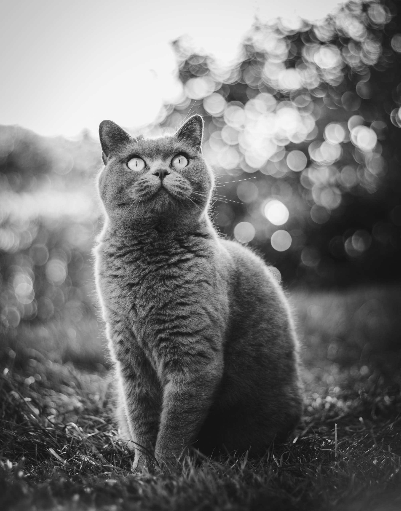

# Image Filters on the Web

This is a mini project proposed in week 4 of the course "Programming Foundations with JavaScript, HTML and CSS" from Coursera (Duke University).

In this project I use JavaScript to create photo filters. This is done by manipulating the RGB values of the image pixels.

[Try it!]()

#### Sample:

|  |
| :--: |
| *Photo without filter* |

|  |
| :--: |
| *Grayscale filter* |

|  |
| :--: |
| *Redscale filter* |

|  |
| :--: |
| *Trigonometry shark filter* |

|  |
| :--: |
| *Window pane filter* |

|  |
| :--: |
| *Rainbow filter :rainbow:* |

|  |
| :--: |
| *Blur filter* |